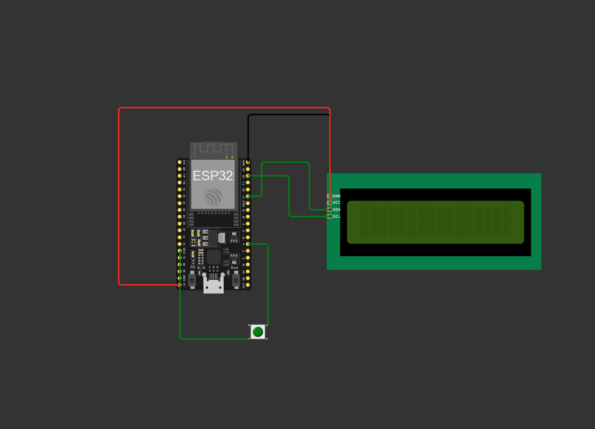

# OBD-dashboard

## 📌 Overview
This project is a real-time **car dashboard** using an **ESP32, an LCD display, and an OBD2 WIFI scanner**. It monitors speed, RPM, engine temperature etc.
 
## 📌 Diagram

